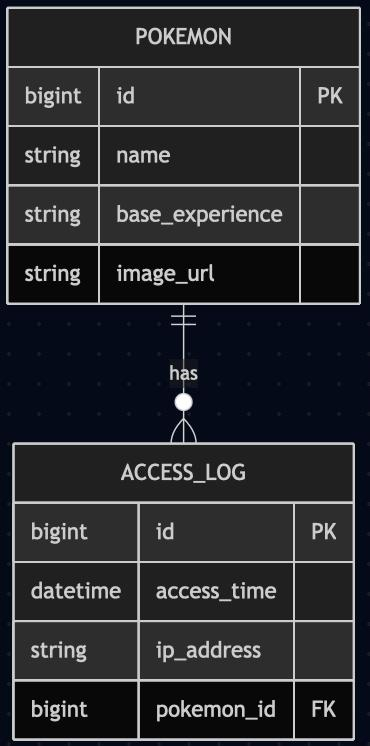

# PokeAPI Service 🧪

Servicio REST que consume la [PokeAPI](https://pokeapi.co) para mostrar la información de un Pokémon y su cadena de evolución.

## 🔧 Tecnologías usadas

### Backend
- Java 21
- Spring Boot 3.2
- Spring Web + Spring MVC
- Spring Data JPA + H2 Database
- Lombok
- Maven
- Slf4j para logs

### Frontend
- React + Vite
- TailwindCSS
- Axios

## 🚀 Características

- Consultar Pokémon por ID
- Ver imagen y experiencia base
- Mostrar cadena de evolución con imágenes
- Guardar logs de acceso e historial
- Persistencia en base de datos (H2)
- Frontend moderno y responsivo

## 📦 Requisitos

- Node.js 18+
- Java 21
- Maven 3+
- IntelliJ (para backend) y VSCode (para frontend)

## ▶️ Cómo ejecutar el proyecto

### Backend

```bash
# En la carpeta backend
cd pokeapi-service
mvn spring-boot:run
```

La API se levantará en: `http://localhost:8080`

### Frontend

```bash
# En la carpeta frontend
cd pokeapi-frontend
npm install
npm run dev
```

La app estará en: `http://localhost:5173`

## 📄 Endpoints principales

| Método | Ruta                          | Descripción                         |
|--------|-------------------------------|-------------------------------------|
| GET    | `/api/pokemon/{id}`           | Devuelve datos del Pokémon          |
| GET    | `/api/pokemon/{id}/evolution` | Devuelve la cadena de evolución     |

## 💾 Base de datos

Dos entidades principales:

- `Pokemon`: id, nombre, experiencia, imagen
- `AccessLog`: fecha, IP, Pokémon consultado

Relación: **Un Pokémon tiene muchos accesos**

## 🧱 Estructura del backend

```
pokeapi-service/
├── controller/
├── service/
├── repository/
├── model/
├── dto/
└── PokeapiServiceApplication.java
```

## Diagrama ER


